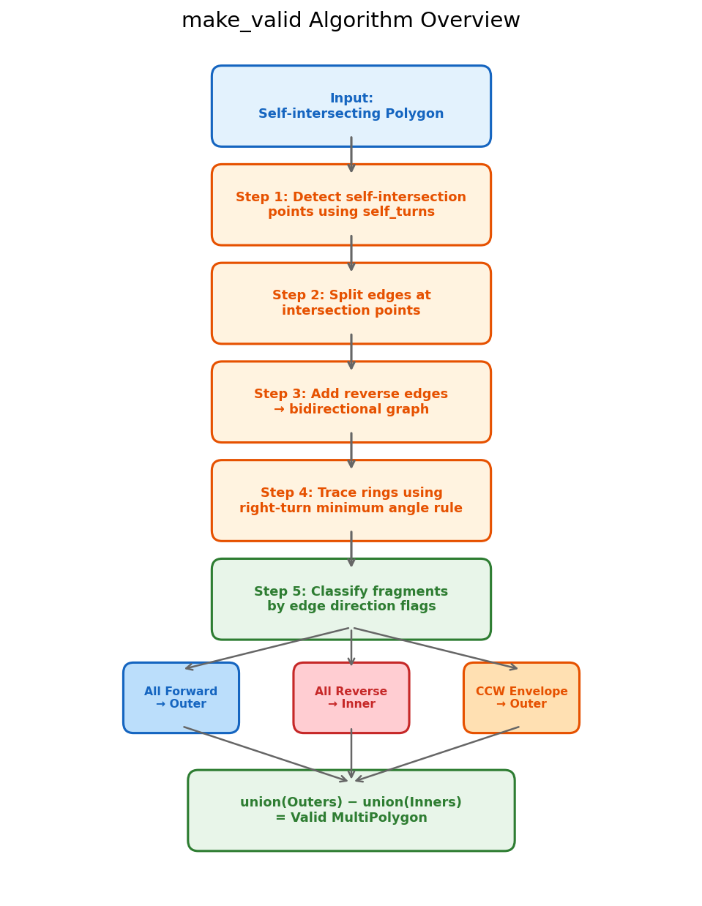
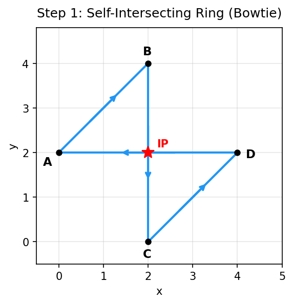
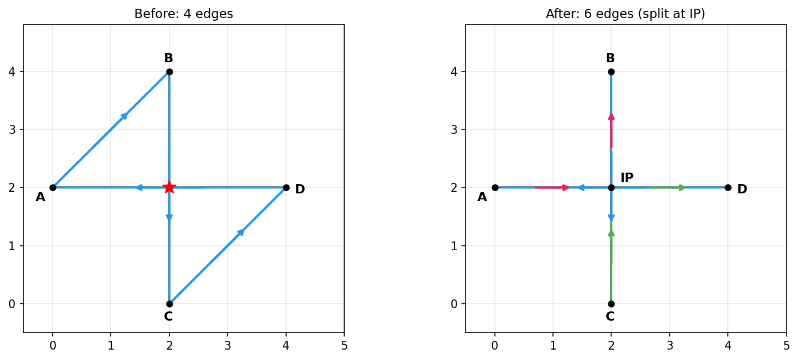
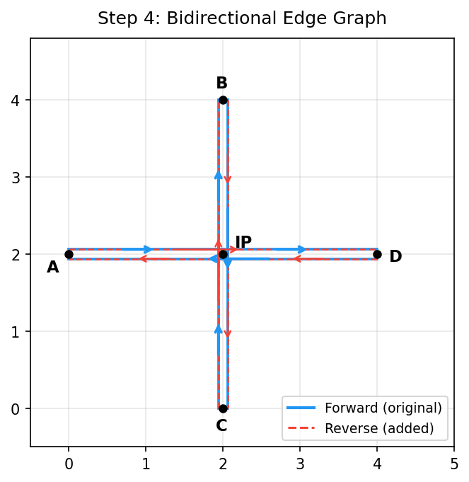
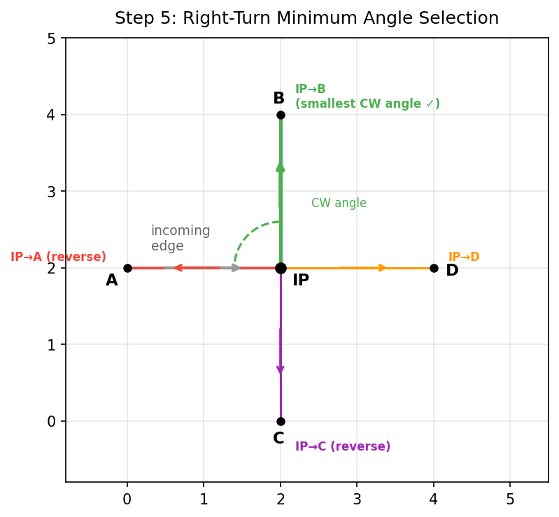
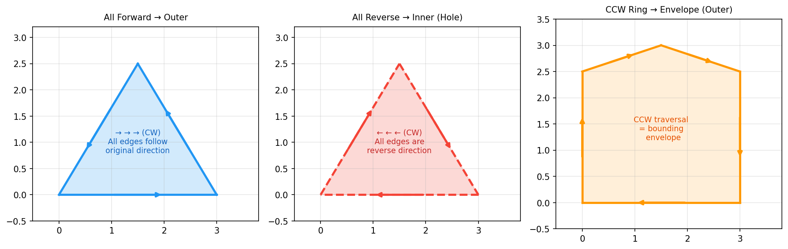
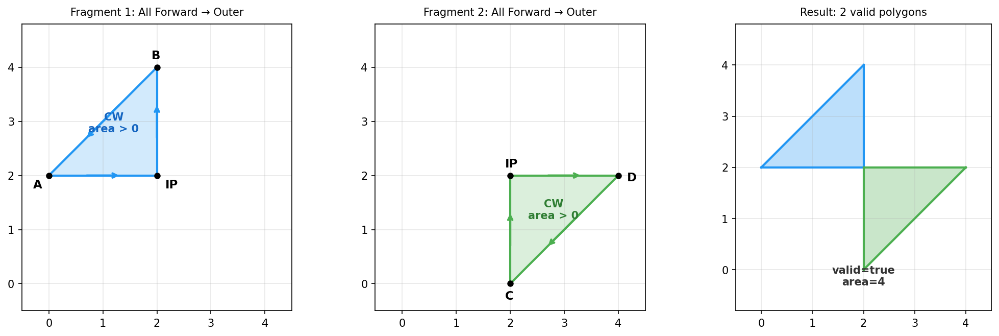
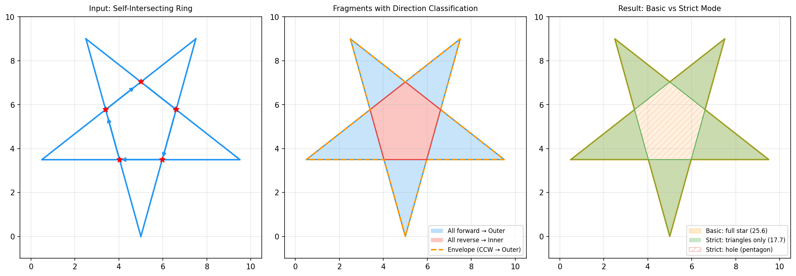

# Boost.Geometry Extension: make_valid

## Overview

`make_valid` converts a Polygon with self-intersecting Rings into a valid MultiPolygon. It provides functionality equivalent to PostGIS `ST_MakeValid`.

## Header

```cpp
#include <boost/geometry/extensions/algorithms/make_valid.hpp>
```

## Interface

```cpp
template <typename Polygon, typename MultiPolygon>
void make_valid(Polygon const& input, MultiPolygon& output,
                make_valid_mode mode = make_valid_mode::basic);
```

### Modes

| Mode | Description | Fill Rule |
|------|-------------|-----------|
| `make_valid_mode::basic` | Combines all fragments as outer rings | Non-zero winding |
| `make_valid_mode::strict` | Treats reverse-direction fragments as holes | Even-odd |

### Usage Example

```cpp
#include <boost/geometry.hpp>
#include <boost/geometry/extensions/algorithms/make_valid.hpp>

namespace bg = boost::geometry;
using point = bg::model::d2::point_xy<double>;
using polygon = bg::model::polygon<point>;
using multi_polygon = bg::model::multi_polygon<polygon>;

// Pentagram (self-intersecting Ring)
polygon pentagram;
bg::read_wkt("POLYGON((5 0,2.5 9,9.5 3.5,0.5 3.5,7.5 9,5 0))", pentagram);

// Basic mode: a single polygon covering the entire star
multi_polygon basic_result;
bg::make_valid(pentagram, basic_result, bg::make_valid_mode::basic);
// area = 25.6158, clips = 1

// Strict mode: only the 5 triangles, with the central pentagon as a hole
multi_polygon strict_result;
bg::make_valid(pentagram, strict_result, bg::make_valid_mode::strict);
// area = 17.7317, clips = 5
```

---

## Algorithm Details

The algorithm decomposes a self-intersecting Ring into simple rings using a **directed edge graph** and **clockwise minimum-angle tracing**, then classifies fragments by edge direction flags.

### Overall Flow



### Step 1: Self-Intersection Detection

Detects intersection points (IPs) between non-adjacent edges of the input Ring.
Uses the Boost.Geometry `self_turns` API to obtain all IPs at once.



The figure shows a bowtie Ring `A(0,2) -> B(2,4) -> C(2,0) -> D(4,2) -> A`.
Edges A->B and C->D intersect at IP(2,2).

### Step 2: Edge Splitting at Intersection Points

Edges are split at intersection points so that each IP becomes an endpoint.
After splitting, more edges exist and all intersections are at vertices.



For the bowtie example, 4 edges become 6:
- A->B -> **A->IP** + **IP->B** (split at intersection)
- B->C -> **B->C** (no split)
- C->D -> **C->IP** + **IP->D** (split at intersection)
- D->A -> **D->A** (no split)

### Step 3: Bidirectional Edge Graph Construction

For each split edge (forward direction), a reverse edge is added.
This builds a **bidirectional edge graph** that allows tracing in any direction.



Each edge carries a **direction flag**:
- **Forward**: same direction as the original Ring (direction = true)
- **Reverse**: added for bidirectional tracing (direction = false)

This direction flag is the key to later fragment classification.

### Step 4: Ring Tracing by Clockwise Minimum-Angle Rule

Simple rings are extracted from the bidirectional graph by always choosing the edge with the **smallest clockwise angle**.



#### Tracing Rules

1. Start from any edge and mark it as visited
2. From all edges leaving the **endpoint** of the current edge, choose the one with the **smallest clockwise angle**
3. Prefer unvisited edges. If all are visited, use a visited edge (fallback)
4. If the chosen edge is already visited, a **loop is closed** -> extract the edges up to that point as a ring
5. After extraction, reset all visited flags and restart with remaining edges

#### Angle Calculation

For the incoming edge's start point A, the current vertex B, and a candidate edge's endpoint C,
the **clockwise angle** from vector BA to BC is calculated using `atan2`.
An angle of 0° is treated as 360°, so going straight (U-turn) has the largest angle.

### Step 5: Fragment Classification by Edge Direction Flags

The direction flags on each edge of an extracted ring determine the fragment type.



| Condition | Classification | Meaning |
|-----------|---------------|---------|
| CW + all edges forward | **outer** | Follows the original Ring's direction |
| CW + all edges reverse | **inner (hole)** | Entirely opposite to the original Ring |
| CW + mixed directions | **outer** | Overlaps resolved by union |
| CCW (counter-clockwise) | **outer (envelope)** | Boundary enclosing the entire Ring |

**Intuitive understanding**: When the original Ring is drawn CW, the "filled" regions
can be traced clockwise using only forward edges. The "unfilled" regions require
reverse edges, producing all-reverse fragments.

### Bowtie Decomposition Example



Tracing result for the bowtie `A(0,2)->B(2,4)->C(2,0)->D(4,2)->A`:

| Fragment | Vertices | Direction Flags | Classification |
|----------|----------|----------------|----------------|
| Upper triangle | B->IP->A->B | All forward | outer |
| Lower triangle | IP->D->C->IP | All forward | outer |

-> Decomposed into 2 valid triangles.

### Pentagram Decomposition Example



Tracing result for the pentagram `(5,0)->(2.5,9)->(9.5,3.5)->(0.5,3.5)->(7.5,9)->(5,0)`:

| Classification | Count | Description |
|---------------|-------|-------------|
| **All forward** -> outer | 5 | The star's 5 triangles |
| **All reverse** -> inner | 1 | The central pentagon |
| **CCW envelope** -> outer | 1 | The star's overall outline |

#### Basic Mode Result
union(5 triangles + pentagon + envelope) = **entire star** (area = 25.6)

#### Strict Mode Result
union(5 triangles + envelope) - union(pentagon) = **5 triangles only** (area = 17.7)

The central pentagon has "all edges reverse" so it is treated as a hole and subtracted.

---

## Result Construction

```
split_ring(OuterRing) -> outer fragments + inner fragments

split_ring(InnerRing) -> inner's outers -> final inners
                       -> inner's inners -> final outers (double inversion)

basic mode:  all fragments -> union as outers
strict mode: union(outers) - union(inners) -> output
```

`split_ring` is a self-contained function operating on a single ring.
It is applied independently to each Outer Ring and Inner Ring,
and the results are combined by the top-level `make_valid` function.

---

## Test Results

### Basic Mode

| Case | Clips | Area | Valid | Notes |
|------|-------|------|-------|-------|
| dissolve_3 (bowtie) | 2 | 4 | ✅ | Bowtie -> 2 triangles |
| dissolve_8 (pentagram) | 1 | 25.6158 | ✅ | Entire star |
| ggl_list_denis | 1 | 22544.2 | ✅ | Complex self-intersection |

### Strict Mode

| Case | Clips | Area | Valid | Notes |
|------|-------|------|-------|-------|
| dissolve_8 (pentagram) | 5 | 17.7317 | ✅ | 5 triangles (center is hole) |
| ggl_list_denis | 6 | 18677.3 | ✅ | Reverse regions become holes |

---

## Differences from dissolve

| Aspect | dissolve | make_valid |
|--------|----------|------------|
| Target | Overlap removal between Polygons | Self-intersection repair of Rings |
| Method | Overlay traverse | Directed edge graph + angle tracing |
| Classification | Overlay ring selection | Edge direction flags |
| Modes | None | basic / strict |

## Dependencies

- `self_turns` — Self-intersection detection
- `union_` — Fragment combination
- `difference` — Hole subtraction in strict mode
- `correct` — Ring winding order correction

## File Structure

```
extensions/algorithms/make_valid.hpp    <- Implementation
src/test_make_valid.cpp                 <- Test driver
src/gen_make_valid_figures.py           <- Figure generation script
```

## Related

- [dissolve](dissolve.md) — Overlap removal between Polygons (not recommended for self-intersecting Rings)
- `boost::geometry::is_valid` — Geometry validity check
- `boost::geometry::correct` — Winding order correction (does not handle self-intersections)
- PostGIS `ST_MakeValid` — Equivalent GIS implementation
